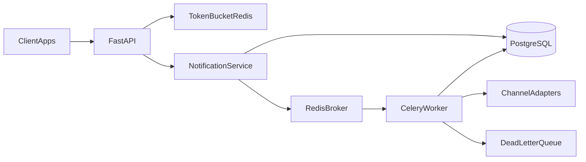

# AGENTS.md — Notifications Engine

This file is the constitution of the project. Cursor and every other agent must read it at the start of a session and obey it. It is not a README: the README teaches humans how to run the service; this file tells agents how to think, code, commit, test, and teach.

The human owner is **EsrgaN** (software engineer). Building the service is the means. Teaching backend is the end.

---

## 1. Mission and teaching protocol (highest priority)

Constructing a robust FastAPI microservice is the vehicle. The primary job of every agent is to help EsrgaN **devour backend knowledge**: architecture, trade-offs, patterns, and the why behind every file.

### 1.1 Language

- Speak to EsrgaN in **Spanish**.
- Write **code, identifiers, comments, commit messages, branch names, and PR bodies in English** (industry standard; learning that convention is part of the curriculum).
- When a term is jargon (Token Bucket, DI, DLQ, idempotency), name it in English and explain it in Spanish the first time it appears in a slice.

### 1.2 What every code change must include

Before or alongside the code, the agent must state:

1. **What pattern this is** (dependency injection, repository, port/adapter, state machine, middleware, etc.).
2. **Why this option** (the problem it solves in *this* service).
3. **What alternative was discarded and why** (at least one real alternative, not a straw man).
4. **Where it lives in the architecture** (which layer, which folder, who is allowed to call it).

Dumping code that “just works” without naming the concept is a protocol violation.

### 1.3 How to teach while building

- Assume EsrgaN wants to understand the system, not only that it compiles.
- Prefer a short architecture note over a wall of prose. Then show the code.
- When introducing a new file, state its **single responsibility** and who depends on it.
- Call out conventions vs. inventions: if something is a FastAPI/Celery/SQLAlchemy idiom, say so; if it is a project rule, say so.
- End each completed slice with **3–6 learning points** (what EsrgaN should now be able to explain to another engineer).
- Do not patronize. Do not skip the why because the change looks “small”.

### 1.4 How to think about architecture (the habit to model)

When proposing a change, reason in this order:

1. What is the **use case** (the business action)?
2. What are the **invariants** (what must never happen)?
3. Which **layer** owns that rule?
4. What **fails** (network, Redis, provider timeout) and how do we degrade?
5. How will we **test** the rule without standing up the whole world?

If a change cannot survive that sequence, it is not ready to land.

---

## 2. Identity, scale, and scope

### 2.1 What this project is

A **bounded, portfolio-senior microservice**: a centralized notifications engine that receives send requests from client applications, enqueues them, dispatches across channels (email, SMS, push, webhook), enforces distributed rate limits, and survives provider failure with retries and a dead-letter queue.

Target scale for v1 (design for this, not for Netflix):

- ~5–20 client applications.
- Thousands of notifications per day, not millions per second.
- One service, five Compose containers, one PostgreSQL, one Redis.

The architecture must be able to grow (ports and adapters, explicit domain, no hidden globals). It must not be over-engineered (no Kafka, no Kubernetes, no service mesh, no multi-region in v1).

### 2.2 In scope (v1)

- FastAPI HTTP API (`/api/v1/...`).
- Pydantic v2 request/response validation.
- API Key auth for client apps (`X-API-Key`).
- Redis Token Bucket rate limiting (per API key, fallback per IP).
- PostgreSQL persistence of notifications and clients.
- SQLAlchemy 2.0 + Alembic-only migrations.
- Celery workers on Redis as broker.
- Immediate `202 Accepted` after persist + enqueue (never send on the request path).
- Exponential backoff retries and a Dead Letter Queue (DLQ).
- Channel adapters behind ports; v1 ships a **simulated** adapter.
- Basic metrics endpoint (success vs failure counts).
- Pytest unit + integration tests.
- `docker-compose.yml` that brings up `app`, `db`, `redis`, `worker`, and `beat`.
- A stellar `README.md` (later slice; not this file).

### 2.3 Out of scope (v1)

Do not add these unless EsrgaN explicitly expands the charter:

- End-user JWT / OAuth for humans (clients are apps, not people).
- A dashboard UI or frontend of any kind.
- Kafka, RabbitMQ, or a second broker.
- Kubernetes, Helm, Terraform, multi-region.
- A full template engine (Jinja/MJML campaigns, localization pipelines).
- Real Mailtrap/Twilio until the port exists and the simulated adapter is tested.
- Distributed tracing platforms, Kubernetes operators, feature flags as a product.

If an agent wants to add an out-of-scope piece “because seniors do it”, it must stop and ask. Premature infrastructure is not seniority.

---

## 3. Locked stack and versions

Do not swap this stack. Do not add a second framework “just in case”.

| Concern | Choice | Why this and not the alternative |
| --- | --- | --- |
| Language | Python 3.12 | Modern typing (`Self`, better `TypedDict`); current FastAPI/Pydantic sweet spot. Not 3.11 unless Compose base images force it; not 3.13 until deps catch up. |
| HTTP | FastAPI + Uvicorn | Async I/O for the wait-heavy API path; OpenAPI for free. Not Django (too much batteries for a focused engine). Not Flask (we want first-class typing and DI). |
| Validation | Pydantic v2 | Strict schemas, `model_config`, performance. Never Pydantic v1 `class Config`. |
| Settings | `pydantic-settings` | Fail-fast env loading; one `Settings` object injected everywhere. |
| Auth (clients) | API Key in `X-API-Key` | Machine-to-machine. JWT would solve a problem we do not have in v1. |
| Rate limit | Redis Token Bucket | Allows controlled bursts; shared across API replicas. Not in-memory (lies under multiple workers). Not Leaky Bucket as default (smoother drain, worse API burst UX). |
| DB | PostgreSQL 14+ | JSON payloads, reliable transactions. Local Homebrew is 14.x; Compose (last phase) must pin a tag we already have or `postgres:14`, not a surprise 16 pull. Not SQLite. |
| ORM | SQLAlchemy 2.0 Mapped style | Explicit mappings, 2.0 query API. Not 1.4 `Query` objects. Not raw SQLAlchemy Core for every CRUD. |
| Migrations | Alembic only | Schema changes are history. Never `create_all` in production code paths. |
| Queue | Celery + Redis broker | Battle-tested retries, countdowns, queues. Not BackgroundTasks for work that must survive process death. |
| Cache / limiter store | Same Redis | One operational dependency for broker + buckets. Separate Redis DBs/indexes, not a second cluster in v1. |
| Scheduler | Celery Beat (optional at first) | Periodic cleanup of old rows. May start as a stub service in Compose. |
| Packaging | `pyproject.toml` | Single source of deps and tool config. Prefer it over a pile of `requirements-*.txt` as the source of truth. |
| Lint / types | Ruff + MyPy | Fast lint/format; gradual typing as a gate, not a decoration. |
| Tests | Pytest (+ pytest-asyncio, httpx) | Standard for FastAPI. |
| Containers | Docker Compose v2 **last** | Packaging only. Day-to-day is a local venv. See `PLAN.md` Phase 12. |

Pin versions in `pyproject.toml` when that file exists. Do not float on unpinned latest for runtime deps.

Celery Beat is **not required in the first implementation slice**. Do not build a cleanup job until notifications actually persist.

**Local-first (mandatory):** follow [`PLAN.md`](PLAN.md). Virtualenv (`uv`) + local Postgres + (from Phase 8) Homebrew Redis. Celery is a **Python package** run as a second process in the same venv — it is not a Docker image. Do **not** add `Dockerfile` / `docker-compose.yml` until Phase 12 unless EsrgaN explicitly asks.

---

## 4. Architecture map and folder contract

### 4.1 Request path vs worker path



Two execution paths, one domain:

- **Synchronous path (API):** authenticate → rate-limit → validate → persist `PENDING` → enqueue → return `202` + `notification_id`. This path must be fast and boring.
- **Asynchronous path (worker):** claim task → `PROCESSING` → call provider port → `SENT` or retry → after max attempts `FAILED` + DLQ.

FastAPI must not send the notification. Celery must not expose HTTP. SQLAlchemy must not leak into routers. Routers talk to **services**. Services talk to **repositories** and **queue ports**. Workers talk to **provider ports** and repositories.

### 4.2 Layers (who may import whom)

| Layer | Folder | May depend on | Must not depend on |
| --- | --- | --- | --- |
| API | `app/api/` | schemas, services, core (auth/deps) | models, Celery internals, provider SDKs |
| Application | `app/services/` | domain, repositories (interfaces), queue port, schemas | FastAPI routers, Celery task modules as business logic |
| Domain | `app/domain/` | nothing in infrastructure | FastAPI, SQLAlchemy, Redis, Celery, Pydantic-if-it-ties-us-to-HTTP |
| Persistence | `app/models/`, `app/repositories/` | domain, SQLAlchemy | FastAPI routers |
| Workers | `app/workers/` | services/domain, provider ports, repositories | API routers |
| Providers | `app/providers/` | domain ports, optional HTTP clients | FastAPI, Celery retry policy (retry belongs to the worker) |

**Port** = interface the application owns (e.g. `NotificationProvider.send(...)`).
**Adapter** = infrastructure that implements the port (simulated, Mailtrap, Twilio).

v1 ships a simulated adapter. Real providers plug in **behind the same port**. The worker must not `import twilio` directly.

### 4.3 Folder layout (do not invent a parallel tree)

```text
notifications-engine/
  AGENTS.md                 # this constitution
  PLAN.md                   # phase order (local-first, Docker last)
  README.md                 # humans (local run; Compose after Phase 12)
  pyproject.toml
  alembic.ini
  docker-compose.yml
  Dockerfile
  .env.example
  app/
    __init__.py
    main.py                 # FastAPI factory (create_app)
    api/
      deps.py               # FastAPI Depends: db session, current client, settings
      middleware/           # rate-limit middleware lives here
      routers/              # HTTP endpoints only
    core/
      config.py             # Settings
      security.py           # API key hashing/verification helpers
      logging.py            # structured logging setup
    domain/
      enums.py              # Channel, NotificationStatus
      exceptions.py         # domain errors (invalid transition, etc.)
      state_machine.py      # legal status transitions
    schemas/                # Pydantic v2 DTOs
    models/                 # SQLAlchemy Mapped models
    repositories/           # data access implementations
    services/               # use cases (send, get status, metrics)
    workers/
      celery_app.py
      tasks.py              # enqueue signatures, retry, DLQ routing
    providers/              # channel adapters implementing ports
  alembic/
    versions/
  tests/
    unit/
    integration/
    conftest.py
```

Rules for the tree:

- One use case per service module when possible (`NotificationService`, not a 1_000-line `utils.py`).
- No `helpers.py` / `misc.py` dumping grounds. If it has no name, it has no home.
- Tests mirror the layers: `tests/unit/domain`, `tests/unit/services`, `tests/integration/api`.
- Do not create `app/utils/` unless a concrete, named utility has two call sites and a test.

### 4.4 Dependency injection

- FastAPI `Depends` is the HTTP composition root.
- Settings, DB session factory, Redis client, and queue port are created once in the app factory / lifespan and injected.
- Never hide `redis.Redis()` or `Session()` construction inside an endpoint body.
- Celery tasks receive ids, not ORM objects. The worker loads state from the DB (tasks must be serializable and retry-safe).

---

## 5. Product contract (the code must not drift)

### 5.1 Endpoints

| Method | Path | Contract |
| --- | --- | --- |
| `POST` | `/api/v1/notifications/send` | Validate body (channel, recipient, template, payload). Authenticate. Consume a token from the client's bucket. Persist `PENDING`. Enqueue. Return **`202 Accepted`** with `notification_id`. Never dispatch in this process. |
| `GET` | `/api/v1/notifications/{id}/status` | Return current status: `PENDING \| PROCESSING \| SENT \| FAILED`. 404 if missing. Authorize so a client only sees its own notifications. |
| `GET` | `/api/v1/metrics` | Basic counts of successful vs failed sends (scoped to the authenticated client unless a later admin story exists). |

Prefix is `/api/v1/`. Do not ship unversioned public routes.

### 5.2 HTTP semantics

- `202` — accepted for async processing (send).
- `401` — missing/invalid API key.
- `404` — notification not found (or not owned; do not leak existence across clients).
- `409` — idempotent replay conflict policy if we choose to reject duplicates instead of returning the original (prefer **return the original notification** for the same `idempotency_key`).
- `422` — Pydantic validation failure (FastAPI default is acceptable if the error schema is consistent).
- `429` — rate limit exceeded. Include `Retry-After` when we can compute it.
- `503` — dependency down (Redis/Postgres) if we cannot accept work safely.

Use one error response shape across the API (e.g. `{"detail": ..., "code": ...}`). Do not mix ad-hoc strings and dicts.

### 5.3 Rate limiting

- Algorithm: **Token Bucket** in Redis.
- Default budget: **10 requests per minute per API key**. If there is no key yet (unauthenticated probe), fall back to IP and still 429 — but the real limiter key is the client id / API key.
- Implementation must be **atomic** in Redis (Lua script or equivalent single-round-trip). Naive GET/SET with a race is not a limiter.
- The limiter runs **before** expensive work (before persist/enqueue).
- In-memory dicts are forbidden: they desynchronize the moment there are two Uvicorn/Celery processes.

### 5.4 Persistence model (minimum fields)

**Notification**

- `id` (UUID)
- `client_id` (FK)
- `channel` (`email` / `sms` / `push` / `webhook`)
- `recipient`
- `template` (identifier string in v1, not a full CMS)
- `payload` (JSON)
- `status`
- `retry_count`
- `idempotency_key` (nullable, unique per client when present)
- `error_message` (nullable, last failure reason)
- timestamps: `created_at`, `updated_at`, `sent_at` (nullable)

**Client / ApiKey**

- Client identity, hashed API key (never store the raw key at rest), active flag, per-client rate-limit overrides (optional; default to global 10/min).

### 5.5 Status machine

Legal transitions:

```text
PENDING -> PROCESSING -> SENT
PENDING -> PROCESSING -> PENDING     # retry scheduled (optional; or stay PROCESSING)
PROCESSING -> FAILED                 # DLQ after max retries
```

Illegal transitions (`SENT -> PENDING`, `FAILED -> SENT` without an explicit replay story) raise a **domain** exception, not a silent overwrite.

### 5.6 Worker, retries, DLQ

- Max attempts: **5** (initial try + retries). Configurable via settings, not magic numbers in task code.
- Countdown: **5s, 15s, 45s** (exponential backoff; further retries continue the factor or cap — document the choice in the task module).
- Retry on provider timeout and provider 5xx-equivalent failures. Do not retry permanent 4xx-equivalent (bad recipient) — mark `FAILED` without burning the backoff budget as if it were transient.
- After exhaustion: status `FAILED`, task routed to a **Dead Letter Queue** named explicitly (e.g. `notifications.dlq`) for later inspection.
- Celery `acks_late` / task idempotency: a retry must not double-send if the provider already succeeded but the DB write failed. Prefer: check status before send; treat `SENT` as terminal.

### 5.7 Idempotency

`POST /send` accepts optional `idempotency_key`. Same client + same key → return the existing notification (still 202 or 200 with the original id), do not enqueue a second task. This is how client retries stop becoming double SMS.

---

## 6. Mandatory coding practices

### 6.1 Python bar

- Type hints on public functions and on anything that crosses a layer boundary.
- Ruff-clean, MyPy-clean for `app/` (tests may be slightly looser, not sloppy).
- Small functions. One reason to change per module.
- No wildcard imports. No `from app import *`.
- No `print` for operational output. Use structured logging.

### 6.2 Structured logging

Every interesting log line should be able to include:

- `notification_id`
- `client_id`
- `channel`
- `status` (when relevant)
- `retry_count` (when relevant)

Do not log raw API keys, authorization headers, or full PII-heavy payloads in production-shaped config. Recipients may be logged in truncated form in development only.

### 6.3 Secrets and config

- Secrets live in environment variables / `.env` (gitignored).
- Commit `.env.example` with **placeholder** values only.
- `Settings` must **fail fast** if required vars are missing (`DATABASE_URL`, `REDIS_URL`, `SECRET_KEY` or equivalent). A booted app with silent `None` is a bug.
- Never hardcode passwords, cloud tokens, or live API keys in source, tests, or this file.

### 6.4 Database

- Alembic is the only schema path. Agents do not “fix prod” with ad-hoc SQL that is not a migration.
- Use SQLAlchemy 2.0 `Mapped[]` / `mapped_column`.
- Sessions: short-lived, request-scoped on the API; task-scoped on the worker. Commit explicitly in the use case, not as a hidden side effect of a helper three calls deep — unless a Unit of Work is introduced *on purpose* and taught.
- JSON columns for `payload`, not a new table per template field in v1.

### 6.5 FastAPI / Pydantic

- Pydantic v2: `model_config = ConfigDict(...)`, not nested `class Config`.
- Request bodies are schemas; ORM models are not dumped straight into routers without an explicit response schema.
- Routers stay thin: parse, call service, map errors to HTTP.

### 6.6 Errors

- Domain exceptions in `app/domain/exceptions.py`.
- A single API exception mapper (handler) translates domain errors to HTTP.
- No `except Exception: pass`. No bare `except:`.
- Catch the narrowest exception that you can actually handle. Log the rest and let it fail the task/request according to policy.

### 6.7 Concurrency and safety

- Rate limiter and idempotency inserts must be safe under concurrent requests (Redis atomicity; unique constraint on `(client_id, idempotency_key)`).
- Celery tasks are retry-safe: sending twice for the same notification_id is a defect.

---

## 7. Git, branches, commits, push, and pull requests

EsrgaN’s user rules override convenience. Agents follow this section strictly.

### 7.1 When to touch git

- **Commit, push, or open a PR only when EsrgaN explicitly asks.**
- Do not volunteer commits “to save the work”.
- Never update git config.
- Never `--no-verify`, `--no-gpg-sign`, or skip hooks unless EsrgaN explicitly requests it.
- Never force-push `main`. If EsrgaN asks to force-push `main`/`master`, warn and refuse the destructive default; suggest a safer path.
- Avoid `git commit --amend` unless EsrgaN asked **and** the HEAD commit is yours **and** it has not been pushed. If a hook rejected a commit, fix and create a **new** commit; do not amend the rejection away.
- No `git rebase -i` / `git add -i` (no interactive git).
- No destructive resets (`hard`) unless EsrgaN explicitly requests them.

### 7.2 Branches

- Base branch: `main`.
- Never commit or push directly to `main`.
- Branch prefixes:
  - `feat/` — new behavior
  - `fix/` — bug
  - `chore/` — tooling, deps, Compose glue
  - `docs/` — README, comments, AGENTS.md
  - `test/` — tests only
  - `refactor/` — no behavior change
- Names: short, kebab-case, English: `feat/token-bucket-middleware`, `fix/dlq-routing`.
- One concern per branch. Do not pile rate-limiting + Alembic + README into a single branch unless EsrgaN asked for a bootstrap slice.

### 7.3 Commits

- Conventional Commits, English, imperative, **why** over laundry-list what:

```text
feat: enqueue notifications before returning 202

Keep the HTTP path free of provider I/O so client apps
get a stable notification_id under load.
```

Allowed types: `feat`, `fix`, `docs`, `test`, `refactor`, `chore`, `ci`.

- One concern per commit. Do not mix formatting-only noise with behavior.
- Never commit `.env`, credential files, private keys, or dump files.
- If EsrgaN asks to commit secrets, refuse and explain.

### 7.4 Push and PRs

- Push with `-u` to the feature branch when EsrgaN asks to publish or open a PR.
- PRs are opened with `gh pr create`. Body template:

```markdown
## Summary
- What changed
- Why this architecture (one or two sentences EsrgaN could reuse in an interview)

## Test plan
- [ ] unit: ...
- [ ] integration: ...
- [ ] docker compose path if relevant
```

- PRs stay small and reviewable. If the diff teaches three unrelated lessons, split.
- Do not merge PRs unless EsrgaN asks.

---

## 8. Tests: when, what, and how

A slice is not done until tests exist and have been run. “It looks correct” is not a gate.

### 8.1 When to write tests

| Change | Tests required |
| --- | --- |
| Domain rule (status machine, backoff policy, bucket math) | Unit tests **first or with** the code. Prefer TDD here. |
| Pydantic schema / validation | Unit tests for accept and reject cases. |
| New endpoint | Integration tests for happy path + 401/422/429 as applicable. |
| Worker retry / DLQ | Unit tests with a fake provider; no live Twilio. |
| Pure refactor | Existing tests must stay green; add only if a gap appears. |
| Docs-only | No code tests. |

Do not add production business logic without a test that would fail if the rule were deleted.

### 8.2 What to test (priority)

Always:

- Pydantic validation (channel, recipient shape, required payload).
- Token Bucket: allow, exhaust, 429, isolation per key.
- Status transitions: legal and illegal.
- Send use case: persist `PENDING`, enqueue once, 202 semantics (via service or API test).
- Idempotency: second send with same key does not double-enqueue.
- Retry/backoff/DLQ: fake provider fails N times then DLQ; permanent errors fail fast.

Integration:

- `POST /send` → 202 and a row in DB (test DB).
- Missing/invalid API key → 401.
- Invalid body → 422.
- Exhausted bucket → 429.
- `GET /status` for own vs other client.

### 8.3 How to test

- Runner: **`pytest`**. Do not invent a custom runner. When Compose exists, document the Compose-based test command in README and use it.
- `tests/unit/` for pure rules (no network). Redis Token Bucket unit tests may use fakeredis or a focused fake; say which and why.
- `tests/integration/` for API + DB. Prefer a real Postgres/Redis in CI/Compose; a SQLite fallback is a last resort and must not diverge from JSON/UUID behavior.
- Mock **external providers** (Mailtrap, Twilio, the internet). Do not mock our own domain objects out of existence.
- Celery: `task_always_eager` in selected tests **or** assert that the queue port was called with the right payload. Do not require a live worker for every unit test.
- Do not chase 100% coverage on glue (`main.py` wiring). Do require that domain and services cannot regress silently.
- If a test needs a sleep to “wait for Redis”, the test is wrong — use fakes, eager mode, or explicit synchronization.

### 8.4 Before declaring a task complete

1. Run the relevant pytest subset, then a broader `pytest` if the slice can affect other layers.
2. Report what ran and what failed. Do not claim green without running.
3. If the environment cannot run tests (no deps yet), say so explicitly and install/run via the project’s chosen path — do not skip silently.

---

## 9. Local environment first, Docker last

Day-to-day (Phases 1–11 in `PLAN.md`):

- Python **3.12 venv** via `uv` (`uv venv .venv --python 3.12`).
- PostgreSQL via **Homebrew** (already present: 14.x). `DATABASE_URL` → `localhost`.
- Redis via **Homebrew** from Phase 8 (`brew install redis`). Not required before that.
- API: `uvicorn` in the venv. Worker: `celery -A ... worker` in the **same** venv. Two processes, zero new images.

Docker Compose is **Phase 12 only** — one trip through pulls/builds when the engine already works. Reason: EsrgaN cannot cheaply pull images mid-project; Compose every slice would also invite volume wipes while we are still learning Alembic.

### 9.1 When Phase 12 happens: Compose services

One `docker-compose.yml`:

| Service | Role |
| --- | --- |
| `app` | FastAPI + Uvicorn |
| `db` | PostgreSQL (pin a tag already on the machine, or `postgres:14`) |
| `redis` | Cache + Celery broker (likely the one new pull) |
| `worker` | Same image as `app`, Celery command |
| `beat` | Celery Beat (may be a stub) |

- App and worker share the same image, different command.
- App depends on db and redis being healthy (`healthcheck` + `depends_on` condition).
- Do not “fix” a broken container by undocumented manual steps inside it. Change `Dockerfile`, Compose, or entrypoint.
- Keep local ports documented in README (API `8000`, Postgres `5432`, Redis `6379`).
- Prefer reusing images already pulled. Do not pin `:latest`.

### 9.2 Runtime policy

- Missing critical env vars → process exits on boot (fail-fast).
- `.env.example` matches **local** defaults (`localhost`). Compose overrides via service hostnames without changing code.
- Migrations: `alembic upgrade head` documented for venv first; Compose entrypoint later. Agents do not assume the schema appears by magic.

---

## 10. Agent workflow checklist

Every implementation slice follows this order. Skipping teaching to “go faster” is a failure.

1. **Read** this file, [`PLAN.md`](PLAN.md), and the current tree. `PLAN.md` describes **only the current phase** and is rewritten when that phase is done. Implement that phase only. Do not invent later features from §10.1.
2. **Explain in Spanish** the slice: use case, layer, pattern, trade-off, test strategy.
3. **Implement the minimum** that proves the use case. No speculative files.
4. **Add or adjust tests** per section 8.
5. **Run tests** and fix failures.
6. **Summarize 3–6 learning points** for EsrgaN.
7. **Git** only if asked (section 7).

### 10.1 Slice sizing

Prefer vertical slices that teach one idea well. **Executable detail lives only in `PLAN.md` (one phase at a time).** Long-term sketch (do not implement from this list):

1. Skeleton + venv + health + README (local). **No Compose.**
2. Settings fail-fast + logging.
3. Domain state machine + unit tests.
4. Models + Alembic + local Postgres.
5. Client API keys.
6. `POST /send` persist + 202 via a **queue port** (not Celery yet).
7. Metrics.
8. Homebrew Redis + Token Bucket + 429.
9. Celery worker in the venv + simulated provider.
10. Retries + DLQ.
11. README / curl polish.
12. Docker Compose **once**.

Do not implement multiple phases in a single unreviewed dump unless EsrgaN explicitly asks to bootstrap everything.

### 10.2 Comments in code

- Comments explain **why**, not what the syntax does.
- Do not narrate `i += 1`.
- A short docstring on public services and ports is expected.

### 10.3 README vs this file

- `AGENTS.md` — agents, architecture law, teaching protocol.
- `README.md` — humans: purpose, mermaid diagram, **venv / Postgres / Redis / uvicorn+celery**, curl/Postman, pytest. Compose instructions only after Phase 12.
- `PLAN.md` — phase order, suggested commits, local-first constraint.
- Do not copy this entire constitution into the README. The README stays operational and impressive; this file stays normative.

---

## 11. Forbidden anti-patterns

These are defects, not style nits. Do not land them.

- Sending the notification **synchronously** inside `POST /send`.
- Returning `200` for an accepted async send (use `202`).
- In-memory rate limiting (dict, `slowapi` memory storage, process-local counters).
- Token Bucket implemented as non-atomic Redis GET/SET.
- Storing raw API keys in PostgreSQL.
- `except: pass` / swallowing provider errors without status + log.
- `print` as the observability strategy.
- God service that imports routers, Celery, SQLAlchemy, and Twilio in one file.
- Celery tasks importing FastAPI routers (wrong direction).
- Routers talking to `Session` queries directly when a repository/service already exists — or, during bootstrap, dumping SQL into the router and leaving it there.
- Schema changes without Alembic (`create_all` as the production migration story).
- Pydantic v1 APIs (`class Config`, `.dict()` as the default — use `model_dump`).
- SQLAlchemy 1.4 `Query` API as the default style.
- Hardcoded secrets or live third-party tokens.
- Hitting real Mailtrap/Twilio from unit tests.
- Sleeping in tests to wait for workers.
- New top-level folders that duplicate `app/` (`src/`, `backend/`, `core/` at repo root) without an explicit, documented reason.
- Kafka, K8s manifests, or extra brokers “for the portfolio” without a product need.
- Adding Dockerfile/Compose before `PLAN.md` Phase 12 (unless EsrgaN asks).
- In-memory rate limiting “because Redis is not installed yet” — wait for Phase 8 or stop and ask.
- Silent `None` settings, defaulting `DATABASE_URL` to a hidden local socket that only works on one machine.
- Mutating `SENT` notifications back to `PENDING` as a retry mechanism.
- Committing to `main`, force-pushing shared history, or committing when EsrgaN did not ask.

---

## 12. Quick reference for agents

```text
Teach in Spanish. Code in English.
API validates + limits + persists PENDING + enqueues + 202.
Workers dispatch through provider ports, never the other way around.
Redis Token Bucket, atomic, per API key, 10/min default, HTTP 429.
Retries 5s/15s/45s; then FAILED + DLQ.
Alembic owns schema. Pytest owns truth. Venv owns day-to-day runtime. Compose is last.
Commit/push/PR only on explicit request.
If you cannot name the pattern and the discarded alternative, do not write the code yet.
```
