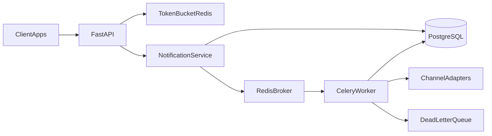

# Notifications Engine

Centralized multichannel notifications microservice: client apps submit send
requests, the API persists and enqueues them, workers dispatch across channels
(email, SMS, push, webhook), and Redis Token Bucket rate limiting protects the
HTTP path. **Day-to-day development is a local Python 3.12 venv** — not Docker.

> **Phase 6 status:** `POST /api/v1/notifications/send` returns 202 and persists
> PENDING; in-memory queue port; still no Celery/Redis. `X-API-Key` remains
> required on product routes. Redis and Celery arrive in later `PLAN.md` rewrites.

## Target architecture

Today the HTTP path is health + request-id + API key auth, plus accept-send:
persist `PENDING`, enqueue the id on an in-memory port, return `202`. Nobody
sends email yet — the in-memory queue does not dispatch. The diagram below is
the **target** shape once later phases land:



## Prerequisites

- Python **3.12**
- [`uv`](https://github.com/astral-sh/uv) (venv + package install)
- PostgreSQL **14.x** via Homebrew (`psql --version` should show 14.x)

Redis is a **later phase**. Docker Compose is the **last** phase.

## Setup

```bash
uv venv .venv --python 3.12
source .venv/bin/activate
uv pip install -e ".[dev]"
cp .env.example .env
```

Create the two local databases (never mix app and test):

```bash
createdb notifications_engine
createdb notifications_engine_test
```

Edit `.env`:

- `SECRET_KEY` ≥ 16 characters (required).
- `DATABASE_URL=postgresql+psycopg://USER@localhost:5432/notifications_engine`
  (replace `USER`; add password if your Homebrew Postgres requires one).

Apply migrations (creates `clients` and `notifications`):

```bash
alembic upgrade head
```

Without `SECRET_KEY` or a `postgresql+psycopg://` `DATABASE_URL`, the process
fails at boot (`ValidationError`) instead of starting with empty config.

## Seed a local client (API key)

There is no admin HTTP endpoint yet. Generate a key once, store only the hash:

```bash
source .venv/bin/activate
python -c "
from app.core.config import get_settings
from app.core.db import create_engine_from_url, create_session_factory
from app.core.security import generate_api_key, hash_api_key
from app.models import Client

raw = generate_api_key()
print(raw)  # save this; it is shown once
engine = create_engine_from_url(get_settings().database_url.get_secret_value())
with create_session_factory(engine)() as session:
    session.add(Client(name='local-dev', hashed_api_key=hash_api_key(raw), is_active=True))
    session.commit()
"
```

## Run

```bash
uvicorn app.main:app --reload --port 8000
```

```bash
curl -i http://127.0.0.1:8000/health
# HTTP/1.1 200 OK
# X-Request-ID: <uuid>
# {"status":"ok"}

curl -i -H 'X-Request-ID: demo-1' http://127.0.0.1:8000/health
# response echoes X-Request-ID: demo-1

curl -i -H "X-API-Key: PASTE_RAW_KEY" http://127.0.0.1:8000/api/v1/clients/me
# 200 {"id":"...","name":"local-dev"}

curl -i http://127.0.0.1:8000/api/v1/clients/me
# 401 {"detail":"Invalid or missing API key","code":"unauthorized"}

curl -i -H "X-API-Key: PASTE_RAW_KEY" -H "Content-Type: application/json" \
  -d '{"channel":"email","recipient":"user@example.com","template":"welcome","payload":{"name":"Ada"},"idempotency_key":"welcome-1"}' \
  http://127.0.0.1:8000/api/v1/notifications/send
# 202 {"notification_id":"...","status":"PENDING"}

curl -i -H "X-API-Key: PASTE_RAW_KEY" \
  http://127.0.0.1:8000/api/v1/notifications/NOTIFICATION_ID/status
# 200 {"notification_id":"...","status":"PENDING"}
```

`/health` stays public (no `X-API-Key`). Product routes under `/api/v1/` require it.

**No email goes out.** `202` means the row is stored as `PENDING` and the id was
handed to an in-memory list. There is no worker yet; restarting the process
forgets the list, but the Postgres row remains.

## Tests

Persistence and auth tests need the test database and a reachable Postgres:

```bash
# Optional override if the default URL needs a user/password:
# export TEST_DATABASE_URL=postgresql+psycopg://USER@localhost:5432/notifications_engine_test
pytest
```

## Docker

Docker Compose is **not** part of this phase; it will arrive in a later
`PLAN.md` rewrite once the engine already runs locally.
