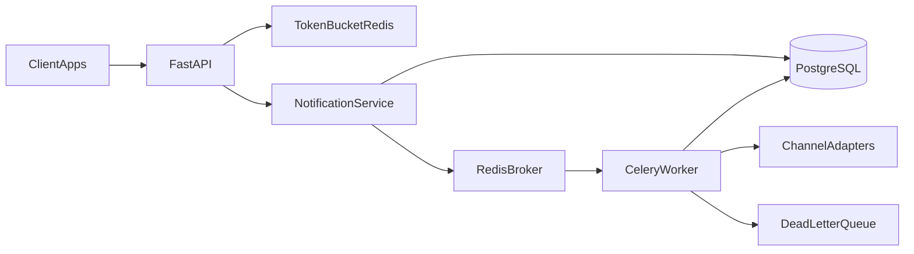

# Notifications Engine

Centralized multichannel notifications microservice: client apps submit send
requests, the API persists and enqueues them, workers dispatch across channels
(email, SMS, push, webhook), and Redis Token Bucket rate limiting protects the
HTTP path. **Day-to-day development is a local Python 3.12 venv** — not Docker.

> **Phase 1 status:** only `GET /health` exists. Product routes (`/api/v1/...`),
> Postgres, Redis, and Celery arrive in later `PLAN.md` rewrites.

## Target architecture

Today the HTTP path is just the health router. The diagram below is the
**target** shape once later phases land:



## Prerequisites

- Python **3.12**
- [`uv`](https://github.com/astral-sh/uv) (venv + package install)

Postgres and Redis are **later phases**. Do not install them for this skeleton.

## Setup

```bash
uv venv .venv --python 3.12
source .venv/bin/activate
uv pip install -e ".[dev]"
```

Optional: copy `.env.example` to `.env` and adjust `APP_NAME` / `ENVIRONMENT`.

## Run

```bash
uvicorn app.main:app --reload --port 8000
```

```bash
curl http://127.0.0.1:8000/health
# {"status":"ok"}
```

## Tests

```bash
pytest
```

## Docker

Docker Compose is **not** part of this phase; it will arrive in a later
`PLAN.md` rewrite once the engine already runs locally.
