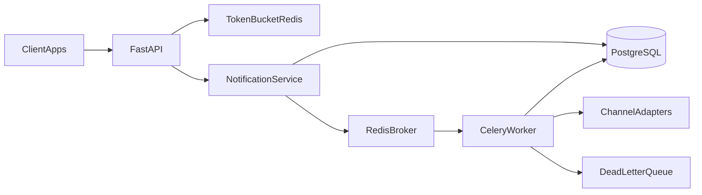

# Notifications Engine

Centralized multichannel notifications microservice: client apps submit send
requests, the API persists and enqueues them, workers dispatch across channels
(email, SMS, push, webhook), and Redis Token Bucket rate limiting protects the
HTTP path. **Day-to-day development is a local Python 3.12 venv** — not Docker.

> **Phase 8 status:** Token Bucket in local Redis; `POST /send` returns 429 after
> 10 req/min per API key; still no Celery. `GET /health` does not talk to Redis.
> `X-API-Key` remains required on product routes.

## Target architecture

Today the HTTP path is health + request-id + API key auth, Token Bucket on
`POST /send` (429 after the burst), accept-send (persist `PENDING`, enqueue the
id, return `202`), and `GET /metrics` (Postgres `COUNT` of `SENT` vs `FAILED`
for that key). Nobody sends email yet — the in-memory queue does not dispatch.
The diagram below is the **target** shape once later phases land:



## Prerequisites

- Python **3.12**
- [`uv`](https://github.com/astral-sh/uv) (venv + package install)
- PostgreSQL **14.x** via Homebrew (`psql --version` should show 14.x)
- Redis **7.x** via Homebrew (`brew install redis`)

Docker Compose is the **last** phase.

## Setup

```bash
uv venv .venv --python 3.12
source .venv/bin/activate
uv pip install -e ".[dev]"
cp .env.example .env
brew services start redis
redis-cli ping    # PONG
```

If `brew services start redis` reports success but `redis-cli ping` is `Connection refused`,
Homebrew Redis 8 may be aborting because `redis.conf` loads modules that are not in the
bottle. Start a plain server on 6379 (enough for this phase):

```bash
redis-server --daemonize yes --port 6379 --bind 127.0.0.1
redis-cli ping
```

Create the two local databases (never mix app and test):

```bash
createdb notifications_engine
createdb notifications_engine_test
```

Edit `.env`:

- `SECRET_KEY` ≥ 16 characters (required).
- `DATABASE_URL=postgresql+psycopg://USER@localhost:5432/notifications_engine`
  (replace `USER`; add password if your Homebrew Postgres requires one).
- `REDIS_URL=redis://localhost:6379/0` (required; process fails at boot without it).
- `RATE_LIMIT_PER_MINUTE=10` (optional; default is 10).

Apply migrations (creates `clients` and `notifications`):

```bash
alembic upgrade head
```

Without `SECRET_KEY`, a `postgresql+psycopg://` `DATABASE_URL`, or a `redis://`
`REDIS_URL`, the process fails at boot (`ValidationError`) instead of starting
with empty config.

## Seed a local client (API key)

There is no admin HTTP endpoint yet. Generate a key once, store only the hash:

```bash
source .venv/bin/activate
python -c "
from app.core.config import get_settings
from app.core.db import create_engine_from_url, create_session_factory
from app.core.security import generate_api_key, hash_api_key
from app.models import Client

raw = generate_api_key()
print(raw)  # save this; it is shown once
engine = create_engine_from_url(get_settings().database_url.get_secret_value())
with create_session_factory(engine)() as session:
    session.add(Client(name='local-dev', hashed_api_key=hash_api_key(raw), is_active=True))
    session.commit()
"
```

## Run

`brew services start redis` must already have printed `PONG` from `redis-cli ping`.

```bash
uvicorn app.main:app --reload --port 8000
```

```bash
curl -i http://127.0.0.1:8000/health
# HTTP/1.1 200 OK
# X-Request-ID: <uuid>
# {"status":"ok"}
# health does not ping Redis; it stays 200 even if Redis is down

curl -i -H 'X-Request-ID: demo-1' http://127.0.0.1:8000/health
# response echoes X-Request-ID: demo-1

curl -i -H "X-API-Key: PASTE_RAW_KEY" http://127.0.0.1:8000/api/v1/clients/me
# 200 {"id":"...","name":"local-dev"}

curl -i http://127.0.0.1:8000/api/v1/clients/me
# 401 {"detail":"Invalid or missing API key","code":"unauthorized"}

curl -i -H "X-API-Key: PASTE_RAW_KEY" -H "Content-Type: application/json" \
  -d '{"channel":"email","recipient":"user@example.com","template":"welcome","payload":{"name":"Ada"},"idempotency_key":"welcome-1"}' \
  http://127.0.0.1:8000/api/v1/notifications/send
# 202 {"notification_id":"...","status":"PENDING"}

curl -i -H "X-API-Key: PASTE_RAW_KEY" \
  http://127.0.0.1:8000/api/v1/notifications/NOTIFICATION_ID/status
# 200 {"notification_id":"...","status":"PENDING"}

curl -i -H "X-API-Key: PASTE_RAW_KEY" http://127.0.0.1:8000/api/v1/metrics
# 200 {"sent":0,"failed":0}
# zeros until a later worker marks rows SENT or FAILED

# 11th send in the same minute (same API key):
curl -i -H "X-API-Key: PASTE_RAW_KEY" -H "Content-Type: application/json" \
  -d '{"channel":"email","recipient":"user@example.com","template":"welcome"}' \
  http://127.0.0.1:8000/api/v1/notifications/send
# 429 {"detail":"Rate limit exceeded","code":"rate_limited"}
# Retry-After: 6
```

`/health` stays public (no `X-API-Key`). Product routes under `/api/v1/` require it.
`GET /health`, `GET /status`, and `GET /metrics` do **not** spend Token Bucket tokens.

**No email goes out.** `202` means the row is stored as `PENDING` and the id was
handed to an in-memory list. There is no worker yet; restarting the process
forgets the list, but the Postgres row remains. **`POST /send` does not move
`sent` or `failed`** — those counts only change when a later worker marks the
row `SENT` or `FAILED`. Celery is not installed.

## Tests

Persistence and auth tests need the test database and a reachable Postgres.
HTTP rate-limit tests use FakeRedis (`ENVIRONMENT=test`); they do **not** need
`brew services start redis`.

```bash
# Optional override if the default URL needs a user/password:
# export TEST_DATABASE_URL=postgresql+psycopg://USER@localhost:5432/notifications_engine_test
pytest
```

## Docker

Docker Compose is **not** part of this phase; it will arrive in a later
`PLAN.md` rewrite once the engine already runs locally.
