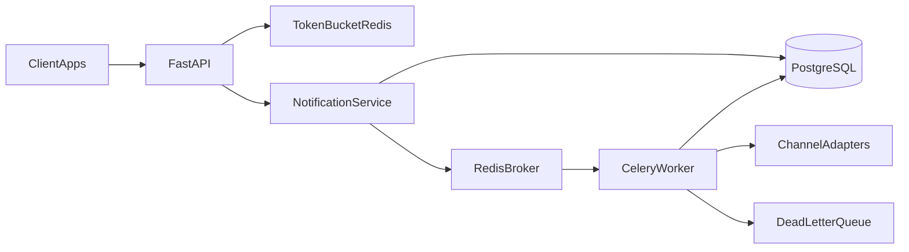

# Notifications Engine

Centralized multichannel notifications microservice: client apps submit send
requests, the API persists and enqueues them, workers dispatch across channels
(email, SMS, push, webhook), and Redis Token Bucket rate limiting protects the
HTTP path. **Day-to-day development is a local Python 3.12 venv** — not Docker.

> **Phase 4 status:** Postgres tables exist (`clients`, `notifications`); still
> no `/send`. `GET /health`, fail-fast `SECRET_KEY` + `DATABASE_URL`, domain
> status machine, SQLAlchemy 2 Mapped models, and Alembic. Product routes
> (`/api/v1/...`), Redis, and Celery arrive in later `PLAN.md` rewrites.

## Target architecture

Today the HTTP path is health + request-id correlation, with a real Postgres
schema ready for later `/send`. The diagram below is the **target** shape once
later phases land:



## Prerequisites

- Python **3.12**
- [`uv`](https://github.com/astral-sh/uv) (venv + package install)
- PostgreSQL **14.x** via Homebrew (`psql --version` should show 14.x)

Redis is a **later phase**. Docker Compose is the **last** phase.

## Setup

```bash
uv venv .venv --python 3.12
source .venv/bin/activate
uv pip install -e ".[dev]"
cp .env.example .env
```

Create the two local databases (never mix app and test):

```bash
createdb notifications_engine
createdb notifications_engine_test
```

Edit `.env`:

- `SECRET_KEY` ≥ 16 characters (required).
- `DATABASE_URL=postgresql+psycopg://USER@localhost:5432/notifications_engine`
  (replace `USER`; add password if your Homebrew Postgres requires one).

Apply migrations (creates `clients` and `notifications`):

```bash
alembic upgrade head
```

Without `SECRET_KEY` or a `postgresql+psycopg://` `DATABASE_URL`, the process
fails at boot (`ValidationError`) instead of starting with empty config.

## Run

```bash
uvicorn app.main:app --reload --port 8000
```

```bash
curl -i http://127.0.0.1:8000/health
# HTTP/1.1 200 OK
# X-Request-ID: <uuid>
# {"status":"ok"}

curl -i -H 'X-Request-ID: demo-1' http://127.0.0.1:8000/health
# response echoes X-Request-ID: demo-1
```

## Tests

Persistence tests need the test database and a reachable Postgres:

```bash
# Optional override if the default URL needs a user/password:
# export TEST_DATABASE_URL=postgresql+psycopg://USER@localhost:5432/notifications_engine_test
pytest
```

## Docker

Docker Compose is **not** part of this phase; it will arrive in a later
`PLAN.md` rewrite once the engine already runs locally.
