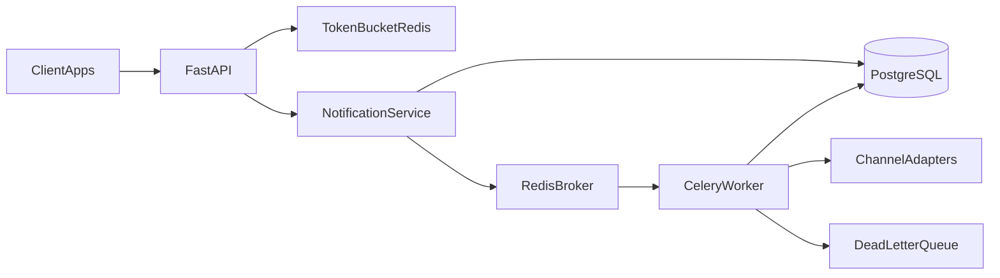

# Notifications Engine

A bounded FastAPI microservice that accepts notification send requests from
**client applications**, persists them as `PENDING`, and returns **202 Accepted**
with a `notification_id`. A **Celery worker in the same Python 3.12 venv** then
dispatches through a **simulated** channel adapter (email / SMS / push / webhook).
Redis Token Bucket rate limiting protects `POST /send`. Retries use backoff
**5s / 15s / 45s** (cap 45s, max 5 attempts); exhausted or permanent failures
become `FAILED` and the id is published to the named queue `notifications.dlq`.

**Day-to-day development is local:** `uv` venv + Homebrew PostgreSQL 14 + one
Homebrew Redis (index `/0` = rate-limit bucket, index `/1` = Celery broker).
Docker Compose is **not** in this README.

v1 talks to **apps**, not humans: authenticate with `X-API-Key`, not JWT.

## What you can demo

- `POST /api/v1/notifications/send` → persist + enqueue → **202** `{notification_id, status: PENDING}`. The HTTP process never talks to a vendor.
- Poll `GET /api/v1/notifications/{id}/status` → `PENDING` → `PROCESSING` → `SENT` (or `FAILED`).
- Same `idempotency_key` + same client → same row, **no second enqueue** (still 202).
- 11th send in one minute → **429** + `Retry-After`.
- `"template": "fail-transient"` → retries then `FAILED` + DLQ log.
- `"template": "fail-permanent"` → `FAILED` on the first attempt.
- `GET /api/v1/metrics` → `{sent, failed}` for **your** API key (Postgres counts).

No real email or SMS goes out.

## Architecture



Two processes, one domain: FastAPI is the counter (accept work). Celery is the
kitchen (call the provider). The DLQ box is the Kombu queue `notifications.dlq`
— inspect via the `notification_dead_lettered` log line plus the Postgres
`FAILED` row. It is not an admin UI.

## HTTP contract

| Method | Path | Auth | Success | Typical errors |
| --- | --- | --- | --- | --- |
| `GET` | `/health` | none | **200** `{"status":"ok"}` | — (no Postgres/Redis/Celery I/O) |
| `GET` | `/api/v1/clients/me` | `X-API-Key` | **200** `{id, name}` | **401** |
| `POST` | `/api/v1/notifications/send` | `X-API-Key` | **202** `{notification_id, status}` | **401**, **422**, **429**, **503** |
| `GET` | `/api/v1/notifications/{id}/status` | `X-API-Key` | **200** `{notification_id, status}` | **401**, **404** |
| `GET` | `/api/v1/metrics` | `X-API-Key` | **200** `{sent, failed}` | **401** |

Product error shape (401 / 404 / 429 / 503): `{"detail": "...", "code": "..."}`.
**422** uses FastAPI/Pydantic’s default body (`detail` as a list of validation
errors) — there is no `code` field on 422.

Only `POST /send` spends a Token Bucket token. `/health`, `/me`, `/status`, and
`/metrics` do not. A 429 still spends the probe: the 11th send is rejected
**before** persist. Idempotent **replays** still spend a token.

| `code` | HTTP | When |
| --- | --- | --- |
| `unauthorized` | 401 | Missing, unknown, or inactive API key (same body for all three) |
| `not_found` | 404 | Status probe: missing id **or** another client’s id (same body) |
| `rate_limited` | 429 | Bucket empty. Header `Retry-After` (seconds) |
| `service_unavailable` | 503 | Redis bucket down (`Rate limiter unavailable`, **no row**) **or** Celery broker down after persist (`Queue unavailable`, row stays `PENDING`) |

Statuses you will see: `PENDING`, `PROCESSING`, `SENT`, `FAILED`.
Channels the body accepts: `email`, `sms`, `push`, `webhook`.

## Prerequisites

- Python **3.12**
- [`uv`](https://github.com/astral-sh/uv)
- PostgreSQL **14.x** via Homebrew (`psql --version`)
- Redis via Homebrew (`brew install redis`) — **one** server, two indexes

## Setup

```bash
uv venv .venv --python 3.12
source .venv/bin/activate
uv pip install -e ".[dev]"
cp .env.example .env
brew services start redis
redis-cli ping    # PONG
```

If `brew services start redis` reports success but `redis-cli ping` is
`Connection refused`, Homebrew Redis 8 may be aborting because `redis.conf`
loads modules that are not in the bottle. Start a plain server on 6379:

```bash
redis-server --daemonize yes --port 6379 --bind 127.0.0.1
redis-cli ping
```

Create the two local databases (never mix app and test):

```bash
createdb notifications_engine
createdb notifications_engine_test
```

Edit `.env`:

- `SECRET_KEY` ≥ 16 characters (required).
- `DATABASE_URL=postgresql+psycopg://USER@localhost:5432/notifications_engine`
  (replace `USER`; add a password if your Homebrew Postgres requires one).
- `REDIS_URL=redis://localhost:6379/0` (Token Bucket; required).
- `CELERY_BROKER_URL=redis://localhost:6379/1` (Celery tickets; **not** `/0`).
- `RATE_LIMIT_PER_MINUTE=10` (optional; default 10).
- `MAX_DELIVERY_ATTEMPTS=5` (optional; default 5).
- `DELIVERY_RETRY_COUNTDOWNS=5,15,45` (optional; extra attempts cap at 45s).

```bash
alembic upgrade head
```

Without `SECRET_KEY`, a `postgresql+psycopg://` `DATABASE_URL`, a `redis://`
`REDIS_URL`, or a `redis://` `CELERY_BROKER_URL`, the process fails at boot
(`ValidationError`) instead of starting with empty config.

## Seed a local client (API key)

There is no admin HTTP endpoint. Generate a key once; store only the hash:

```bash
source .venv/bin/activate
python -c "
from app.core.config import get_settings
from app.core.db import create_engine_from_url, create_session_factory
from app.core.security import generate_api_key, hash_api_key
from app.models import Client

raw = generate_api_key()
print(raw)  # save this; it is shown once
engine = create_engine_from_url(get_settings().database_url.get_secret_value())
with create_session_factory(engine)() as session:
    session.add(Client(name='local-dev', hashed_api_key=hash_api_key(raw), is_active=True))
    session.commit()
"
```

Export it for the copy-paste curls below:

```bash
export API_KEY='PASTE_RAW_KEY'
```

## Run

You need **two** processes in the **same** venv (repo root, `.env` present).
Redis must already answer `PONG`.

```bash
# terminal 1
uvicorn app.main:app --reload --port 8000

# terminal 2
celery -A app.workers.celery_app worker --loglevel=INFO --queues=notifications,notifications.dlq
```

OpenAPI (Swagger UI) while uvicorn is up:

- Browser: [http://127.0.0.1:8000/docs](http://127.0.0.1:8000/docs)
- ReDoc: [http://127.0.0.1:8000/redoc](http://127.0.0.1:8000/redoc)
- Raw spec: [http://127.0.0.1:8000/openapi.json](http://127.0.0.1:8000/openapi.json)

**Postman:** Import → Link → paste `http://127.0.0.1:8000/openapi.json`. Add a
collection header `X-API-Key` = your seeded raw key. `/health` needs no header.

## Happy path (copy-paste)

```bash
curl -i http://127.0.0.1:8000/health
# HTTP/1.1 200 OK
# X-Request-ID: <uuid>
# {"status":"ok"}
# stays 200 even if Redis is down — liveness, not readiness

curl -i -H 'X-Request-ID: demo-1' http://127.0.0.1:8000/health
# response echoes X-Request-ID: demo-1

curl -i -H "X-API-Key: $API_KEY" http://127.0.0.1:8000/api/v1/clients/me
# 200 {"id":"...","name":"local-dev"}

curl -s -H "X-API-Key: $API_KEY" -H "Content-Type: application/json" \
  -d '{"channel":"email","recipient":"user@example.com","template":"welcome","payload":{"name":"Ada"},"idempotency_key":"welcome-1"}' \
  http://127.0.0.1:8000/api/v1/notifications/send
# 202 {"notification_id":"...","status":"PENDING"}
```

Capture the id and poll until the worker marks `SENT` (a few seconds if the
worker is running). FastAPI does **not** wait for the provider.

```bash
export NID='NOTIFICATION_ID'   # paste notification_id from the 202 body

for i in $(seq 1 20); do
  curl -s -H "X-API-Key: $API_KEY" \
    "http://127.0.0.1:8000/api/v1/notifications/${NID}/status"
  echo
  curl -s -H "X-API-Key: $API_KEY" \
    "http://127.0.0.1:8000/api/v1/notifications/${NID}/status" \
    | grep -q '"SENT"' && break
  sleep 2
done

curl -i -H "X-API-Key: $API_KEY" http://127.0.0.1:8000/api/v1/metrics
# 200 {"sent":1,"failed":0}
```

If the Celery process is **not** running, `GET /status` stays `PENDING`. That is
correct: the row is already in Postgres; nobody is cooking.

Replay (same client + same `idempotency_key`) returns the **original** id and
does not enqueue a second task:

```bash
curl -s -H "X-API-Key: $API_KEY" -H "Content-Type: application/json" \
  -d '{"channel":"email","recipient":"user@example.com","template":"welcome","idempotency_key":"welcome-1"}' \
  http://127.0.0.1:8000/api/v1/notifications/send
# 202 {"notification_id":"<same as first>","status":"PENDING"}  # or SENT if the worker already ran
```

## Error path (copy-paste)

```bash
curl -i http://127.0.0.1:8000/api/v1/clients/me
# 401 {"detail":"Invalid or missing API key","code":"unauthorized"}

curl -i -H "X-API-Key: $API_KEY" -H "Content-Type: application/json" \
  -d '{"channel":"fax","recipient":"user@example.com","template":"welcome"}' \
  http://127.0.0.1:8000/api/v1/notifications/send
# 422  (Pydantic default body; channel must be email|sms|push|webhook)

curl -i -H "X-API-Key: $API_KEY" \
  http://127.0.0.1:8000/api/v1/notifications/00000000-0000-0000-0000-000000000000/status
# 404 {"detail":"Notification not found","code":"not_found"}
```

Rate limit (11th `POST /send` in the same minute, same key):

```bash
curl -i -H "X-API-Key: $API_KEY" -H "Content-Type: application/json" \
  -d '{"channel":"email","recipient":"user@example.com","template":"welcome"}' \
  http://127.0.0.1:8000/api/v1/notifications/send
# 429 {"detail":"Rate limit exceeded","code":"rate_limited"}
# Retry-After: <seconds>
```

503 is easier to see if Redis is stopped **after** uvicorn started:

- Stop Redis, then `POST /send` → **503** `{"detail":"Rate limiter unavailable","code":"service_unavailable"}` and **no new row**.
- Redis up, Celery broker URL pointing at a dead index / Redis stopped **after** the limiter ran is not the usual demo: if enqueue fails, the API returns **503** `{"detail":"Queue unavailable","code":"service_unavailable"}` and the `PENDING` row **remains**.

## Simulated failures (worker must be running)

```bash
# Transient: retries 5s, 15s, 45s, 45s then FAILED + log notification_dead_lettered
curl -s -H "X-API-Key: $API_KEY" -H "Content-Type: application/json" \
  -d '{"channel":"email","recipient":"user@example.com","template":"fail-transient"}' \
  http://127.0.0.1:8000/api/v1/notifications/send
# poll GET /status: PENDING between attempts, then FAILED
# GET /metrics → failed increments only after FAILED (~110s wall clock)

# Permanent: FAILED on the first attempt, no 5s wait
curl -s -H "X-API-Key: $API_KEY" -H "Content-Type: application/json" \
  -d '{"channel":"email","recipient":"nobody@example.com","template":"fail-permanent"}' \
  http://127.0.0.1:8000/api/v1/notifications/send
```

`"template":"welcome"` (any value other than the two exact fail switches) succeeds.
Templates are exact strings: `fail-transient-welcome` does **not** fail.

`POST /send` never increments `sent` / `failed`. Those counts change when the
worker commits `SENT` or `FAILED`. FastAPI does not wait for backoff.

## Tests

Persistence and auth tests need Postgres and `notifications_engine_test`.
HTTP rate-limit tests use FakeRedis (`ENVIRONMENT=test`); they do **not** need
`brew services start redis`. Pytest uses the in-memory queue and does **not**
start a Celery worker (no `task_always_eager` on the HTTP fixture). Pytest
**does not** `sleep` through 5s/15s/45s — it asserts the countdown.

```bash
# Optional override if the default URL needs a user/password:
# export TEST_DATABASE_URL=postgresql+psycopg://USER@localhost:5432/notifications_engine_test
pytest
```

## Layout (where to look)

```text
app/api/          HTTP: routers, deps, middleware (no SQLAlchemy queries, no Celery)
app/services/     use cases (accept, dispatch, metrics)
app/domain/       enums, state machine, retry policy (no FastAPI/SQLAlchemy)
app/models/       SQLAlchemy 2 Mapped
app/repositories/ Postgres access
app/workers/      Celery process (ids in, DispatchService out)
app/providers/    simulated adapter behind a port
app/core/         Settings, logging, Token Bucket, DB engine
tests/unit/       pure rules
tests/integration/ API + Postgres
```

## Troubleshooting

| Symptom | Likely cause | What to do |
| --- | --- | --- |
| `ValidationError` on boot | Missing `.env` field | Copy `.env.example`; `SECRET_KEY` ≥ 16; URLs must use `postgresql+psycopg://` and `redis://` |
| `redis-cli ping` → Connection refused | Homebrew Redis 8 + modules | Use the `redis-server --daemonize yes` snippet above |
| `createdb: already exists` | You already created it | Continue |
| `alembic` / missing relation `clients` | Schema not applied | `alembic upgrade head` |
| 202 but status stays `PENDING` | Worker process not running | Start the `celery -A … worker` command; leave uvicorn up |
| 503 `Rate limiter unavailable` | Redis index 0 down | `redis-cli ping`; zero new notification rows |
| 503 `Queue unavailable` | Broker (index 1) down after persist | Row is `PENDING` in Postgres; fix Redis and retry enqueue is **not** automatic — inspect the row |
| 429 immediately | Burst of 10 already spent | Wait `Retry-After` seconds or use a fresh seeded key |
| 401 on `/me` | Wrong key or forgot header | Paste the **raw** key from seed, not the hash |
| `failed` still 0 after `fail-transient` | Worker still backing off | Wait; `failed` moves only when the row is `FAILED` |

## Not in v1

Celery Beat, admin replay UI, real Mailtrap/Twilio, JWT/OAuth, a dashboard,
Kafka, Kubernetes, and Docker Compose. Container packaging is planned for a later phase
once this local runbook already works.
