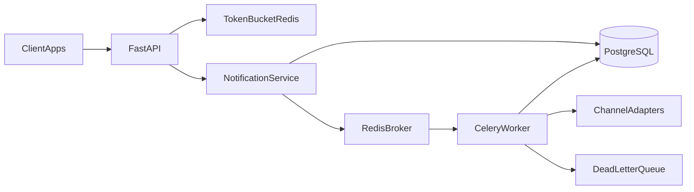

# Notifications Engine

Centralized multichannel notifications microservice: client apps submit send
requests, the API persists and enqueues them, workers dispatch across channels
(email, SMS, push, webhook), and Redis Token Bucket rate limiting protects the
HTTP path. **Day-to-day development is a local Python 3.12 venv** — not Docker.

> **Phase 3 status:** domain states exist; still no `/send`. `GET /health`,
> fail-fast `SECRET_KEY`, and structured logging with `X-Request-ID`. Product
> routes (`/api/v1/...`), Postgres, Redis, and Celery arrive in later
> `PLAN.md` rewrites.

## Target architecture

Today the HTTP path is health + request-id correlation. The diagram below is the
**target** shape once later phases land:



## Prerequisites

- Python **3.12**
- [`uv`](https://github.com/astral-sh/uv) (venv + package install)

Postgres and Redis are **later phases**. Do not install them for this slice.

## Setup

```bash
uv venv .venv --python 3.12
source .venv/bin/activate
uv pip install -e ".[dev]"
cp .env.example .env
```

`SECRET_KEY` is **required** (≥16 characters). Without it the process fails at
boot (`ValidationError`) instead of starting with empty config. Edit `.env` after
copying `.env.example`.

## Run

```bash
cp .env.example .env
uvicorn app.main:app --reload --port 8000
```

```bash
curl -i http://127.0.0.1:8000/health
# HTTP/1.1 200 OK
# X-Request-ID: <uuid>
# {"status":"ok"}

curl -i -H 'X-Request-ID: demo-1' http://127.0.0.1:8000/health
# response echoes X-Request-ID: demo-1
```

## Tests

```bash
pytest
```

## Docker

Docker Compose is **not** part of this phase; it will arrive in a later
`PLAN.md` rewrite once the engine already runs locally.
